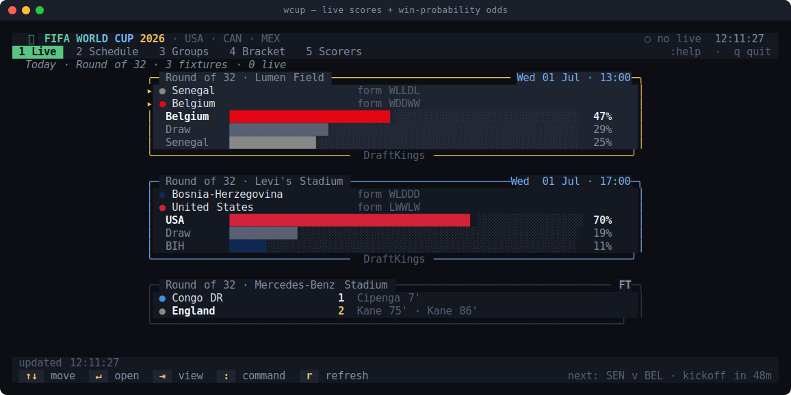
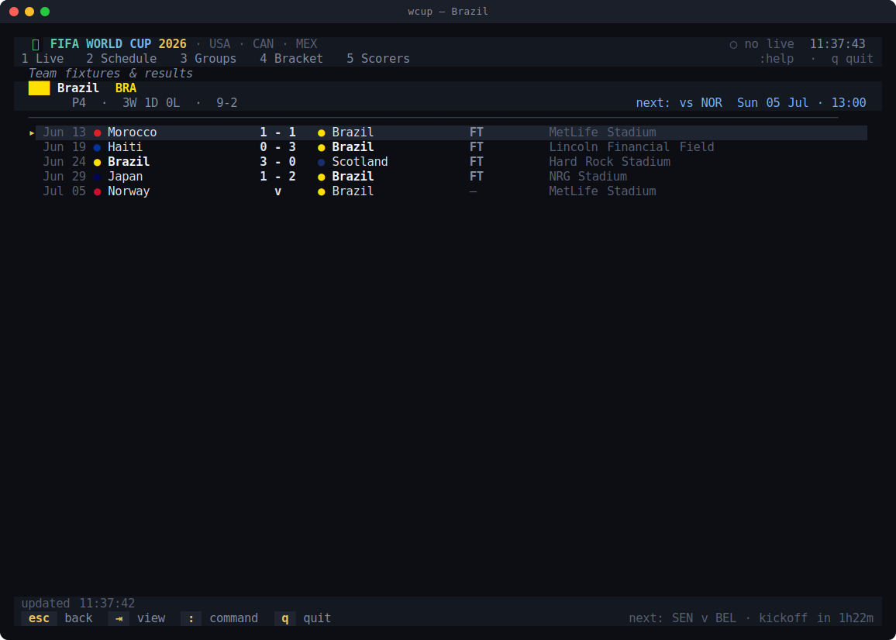
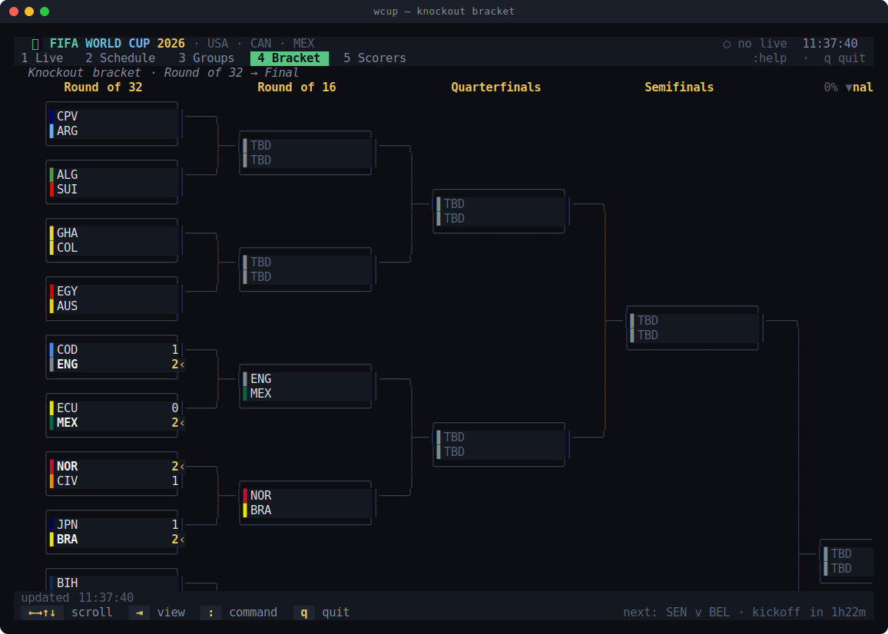
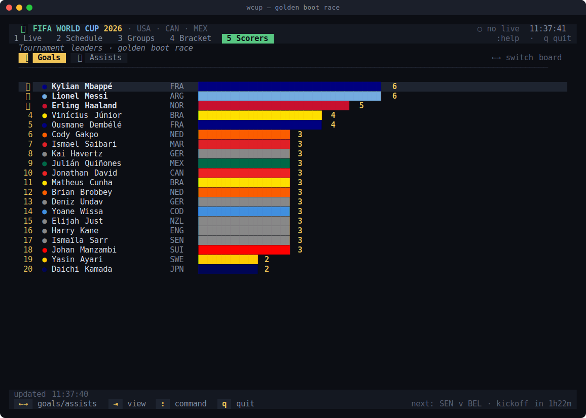
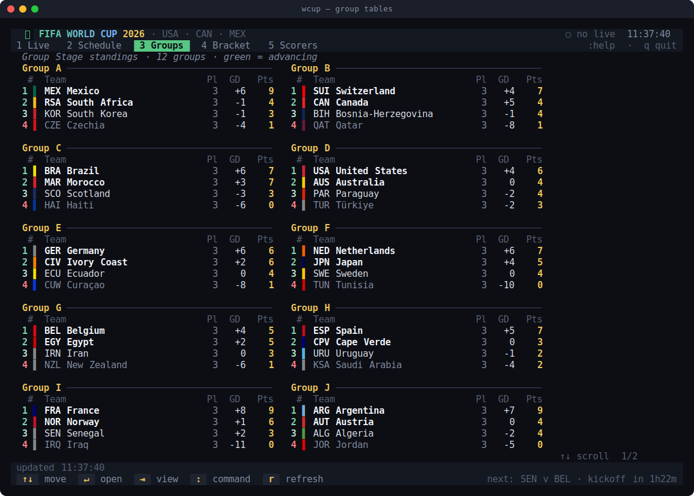
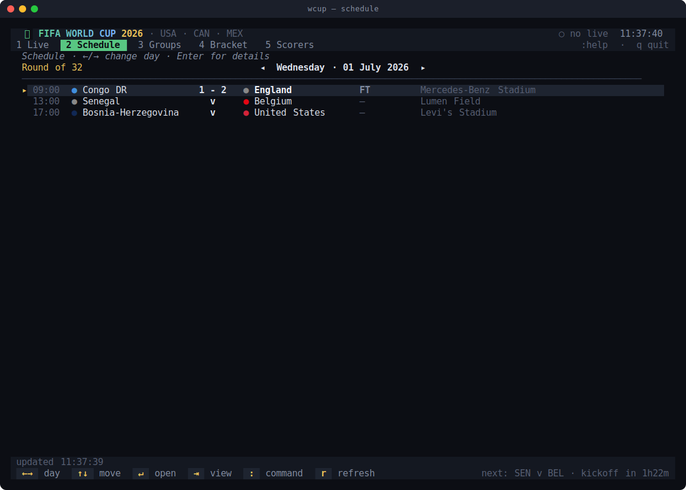
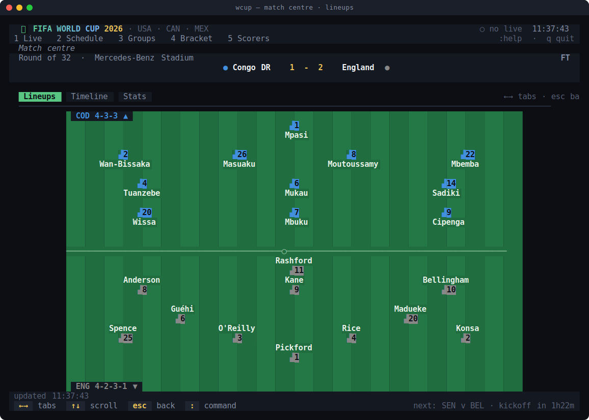
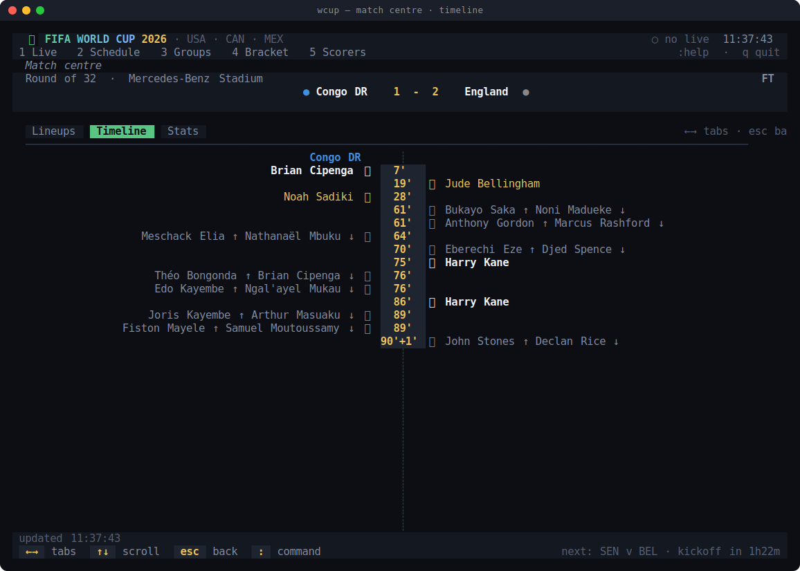
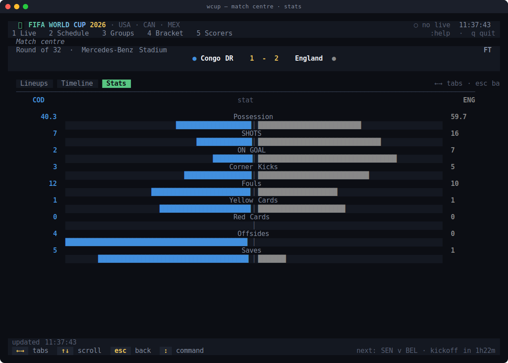

# ⚽ World Cup Terminal

A terminal dashboard for following the **2026 FIFA World Cup** live — scores,
goalscorers, lineups, group tables, the knockout bracket, the golden-boot race
and **win-probability odds** — all in your terminal, updating live, driven
entirely by the keyboard.

**No dependencies. No API key. Pure Python 3 standard library.** Data (odds
included) comes from ESPN's public JSON feeds.

<p align="center">
  
</p>

---

## Install

```sh
git clone https://github.com/0JamesAB/worldcup26.git
cd worldcup26
./install.sh
```

That drops a small `wcup` launcher in `~/.local/bin` (override with
`PREFIX=/usr/local/bin ./install.sh`). Nothing else is copied anywhere, and there's
nothing to pip-install. Already had a terminal open? Run `hash -r` so it's found.

Prefer not to install? Just run it in place: `python3 wc.py`.

Requirements: Python 3.8+ and a real terminal (truecolor auto-detected, degrades to
256/16 colours). Make the window ≥ 100 cols wide for the bracket and lineups.

To remove: `./uninstall.sh`.

---

## Use

```sh
wcup                  # live scores (today)
wcup --ENG            # a nation's page — any 3-letter code (BRA, USA, MEX, KOR…)
wcup --team england   # …or by name
wcup --teams          # list every team code
wcup groups           # start on a view: live | schedule | groups | bracket | scorers
wcup --date 20260703  # jump the schedule to a date (YYYYMMDD)
wcup --help           # usage
wcup --snapshot 120x40 bracket   # render one frame to stdout (no TTY) — good for screenshots
```

<p align="center">
  
  <br><sub><code>wcup --BRA</code> — a nation's results, record and next fixture.</sub>
</p>

---

## Views

| Key | View       | What you get                                                            |
|-----|------------|-------------------------------------------------------------------------|
| `1` | **Live**   | Today's matches as cards — live clock, score, who scored when, and win-probability odds for upcoming games. |
| `2` | **Schedule** | Browse fixtures by day (`←/→`); kickoff times in your local timezone. |
| `3` | **Groups** | All 12 group tables, colour-coded by who's advancing.                   |
| `4` | **Bracket**| The full knockout tree, Round of 32 → Final, with connectors & shootouts.|
| `5` | **Scorers**| Golden-boot & assists leaderboards with bars.                           |

<table>
  <tr>
    <td width="50%"><br><sub><b>4 · Bracket</b> — the knockout tree, with feeders reconstructed from placeholders.</sub></td>
    <td width="50%"><br><sub><b>5 · Scorers</b> — the golden-boot race, bars scaled to the leader.</sub></td>
  </tr>
  <tr>
    <td width="50%"><br><sub><b>3 · Groups</b> — all 12 tables at once, green = advancing.</sub></td>
    <td width="50%"><br><sub><b>2 · Schedule</b> — browse fixtures day by day with <code>←/→</code>.</sub></td>
  </tr>
</table>

Press **Enter** on any match to open the **Match Centre**:

* **Lineups** – both starting XIs drawn on a pitch by formation, plus the bench.
* **Timeline** – goals ⚽, cards 🟨🟥 and subs 🔁 on a centre spine, away left / home right.
* **Stats** – possession, shots, corners… as head-to-head bars.

<table>
  <tr>
    <td width="34%"><br><sub><b>Lineups</b></sub></td>
    <td width="34%"><br><sub><b>Timeline</b></sub></td>
    <td width="34%"><br><sub><b>Stats</b></sub></td>
  </tr>
</table>

---

## Odds

Upcoming matches show **win-probability odds** — a bar per outcome (home · draw ·
away), sized by the market's implied chance and coloured by team:

<p align="center">
  
</p>

* **No key, no setup.** The odds ride along in the same ESPN scoreboard feed the
  app already fetches (ESPN embeds a sportsbook's lines — DraftKings in the US).
  No account, no extra request, no new dependency.
* **Vig-removed.** The three American moneyline prices are converted to implied
  probabilities and normalised so they sum to 100% — an honest read of the
  market, not the bookmaker's padded numbers.
* **Graceful by design.** Odds appear only where the feed prices a game, so they
  simply don't show for finished matches, for fixtures not yet priced (e.g. a
  Round-of-16 tie whose teams are still TBD), or if the feed omits them. Nothing
  to configure and nothing breaks when they're absent.
* **In the Match Centre**, a compact moneyline strip sits under the score on
  every tab, and a fuller panel (with over/under and spread) fills the Lineups
  tab until the teamsheets drop ~1h before kickoff.

**Tuning** (both optional):

| Env var | Effect |
|---------|--------|
| `WCUP_ODDS=off` | Hide odds entirely. |
| `WCUP_ODDS_FORMAT=decimal` | Show decimal prices (`2.15`) instead of American (`+115`). |

---

## Keys

```
1–5            switch view              ↵ Enter   open match details
Tab / ⇧Tab     cycle views             Esc       back
↑ ↓  / j k     move selection          PgUp/PgDn  page · Home/End  jump
← →  / h l     day · detail tabs · bracket scroll
:              command line             r  refresh now      ?  help      q  quit
```

## Command line ( press `:` )

Press `:` and a **live suggestion menu** appears. Keep typing to filter; the menu
shows each command's syntax and, once you've picked one, completes its arguments —
team names, group letters, dates, match ids. `⇥ Tab` accepts the highlighted
suggestion (there's an inline ghost preview), `↑ ↓` move, `↵` runs, `Esc` cancels.

```
:live                     jump to live scores
:schedule [date]          open the schedule (date = YYYYMMDD | today | +N | -N)
:date <YYYYMMDD|+N|-N>    set the schedule date
:groups [A-L]             group tables, optionally jump to a group
:bracket                  knockout bracket
:scorers   /  :assists    golden boot / assists
:team <name|ABBR>         a nation's results & fixtures   (e.g.  :team brazil)
:match <id>               open a match by ESPN event id
:refresh                  force a refresh        :help        :quit
```

So `:` → `te` → `⇥` → `bra` → `⇥` → `↵` walks you straight to Brazil's page.

---

## How it works

* **`espn.py`** – thin client over ESPN's public World Cup JSON (scoreboard, match
  summary, standings, leaders, embedded odds), with a thread-safe TTL cache and
  stale-on-error fallback so a dropped connection just shows a "reconnecting" hint.
  Also holds the odds model and the American→probability/decimal conversions.
* **`state.py`** – app state + a background refresher thread that keeps the active
  view fresh (live scores every ~12 s) and raises a goal/kick-off/FT toast when a
  scoreline changes.
* **`term.py`** – terminal control: raw key decoding (arrows, etc.), the alternate
  screen, ANSI truecolor, and a diff renderer that repaints only changed cells.
* **`ui.py`** – a styled-cell `Canvas` for absolute positioning (the bracket and the
  lineup pitch are drawn on one), box-drawing, tabs and the footer.
* **`views.py`** – every screen, including the knockout bracket, whose feeder graph
  is reconstructed from ESPN's placeholder names (`"Round of 16 5 Winner"`) and, for
  rounds already played, by matching each team back to the fixture it won.
* **`wc.py`** – the entry point: input loop, argument parsing and the `wcup` command.

---

## Notes

* **Unofficial.** Data comes from ESPN's public JSON endpoints. This project isn't
  affiliated with or endorsed by ESPN or FIFA; it's for personal, non-commercial use.
  If a field ever changes upstream, the affected view degrades to a "loading /
  unavailable" message rather than crashing.
* **Contributions welcome** — it's a small, dependency-free codebase; open an issue or PR.
* **License:** [MIT](LICENSE).

⚽ *Full time.*
